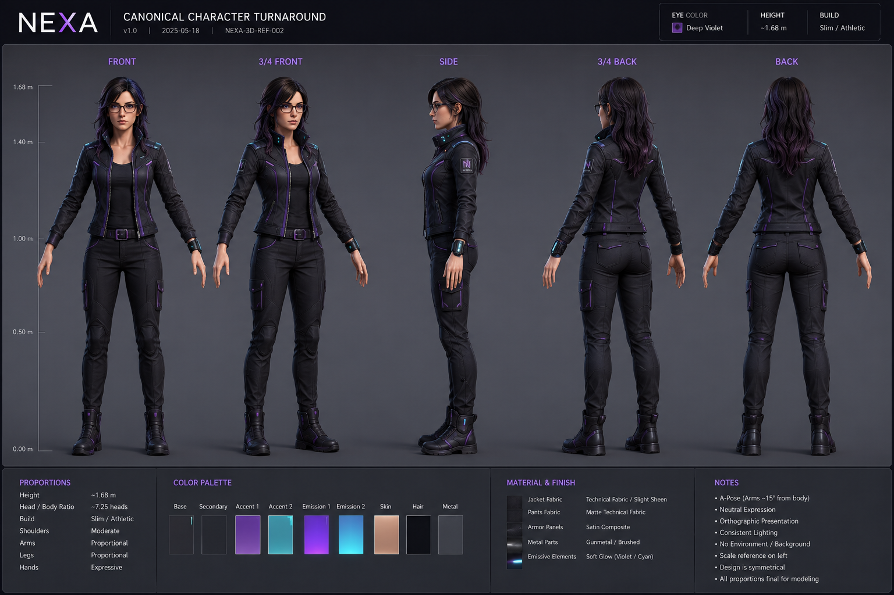
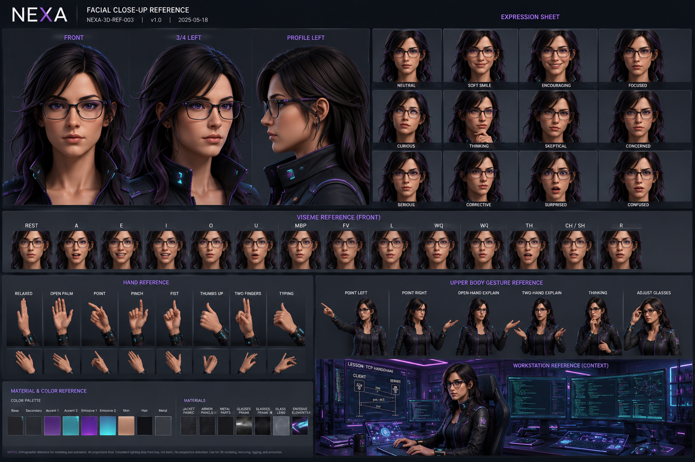

# Nexa 3D Training Tutor — Source Design Conversation

**Status:** provenance record — verbatim import, do not edit  
**Exported:** 2026-08-18

This is the unmodified export of the design conversation that produced the Nexa 3D
specifications, kept so every downstream document has a traceable origin. The specifications
themselves live alongside it as [NEXA-3D-001](../NEXA-3D-001.md),
[NEXA-3D-ART-001](../NEXA-3D-ART-001.md), and [NEXA-3D-REF-001](../NEXA-3D-REF-001.md);
edit those, not this file.

Only the two image links below were rewritten, to point at the copies committed under
`images/`. The PDF and Word renderings from the original bundle carry the same content in
binary form and were not committed.

---

This bundle captures the Nexa animated hacker-girl training tutor design conversation,
including the 3D architecture, character-production specifications, reference/turnaround
specification, and the two generated canonical visual reference sheets.

Export date: 2026-08-18

## User

I want to create an animated hacker girl avatar to be used as a training tutor system, can you help me with that?

## Conversation progression

The project was iteratively developed through the avatar/tutor architecture. The user repeatedly approved continuation ("all right go", "oh thats perfect", "ok let's go", "lets do it", "next", etc.) and requested that the project move to 3D soon. The detailed 3D portion preserved below is the production baseline reached in this conversation.

## Assistant

NEXA-3D-001 — 3D Character, Humanoid Rig, Facial Animation & Rendering Architecture v1.0

Purpose: Define Nexa's production-grade 3D embodiment, including canonical asset format,
humanoid skeleton, facial rig, blendshapes, visemes, gaze, inverse kinematics, gestures,
animation graphs, physics, materials, lighting, camera behavior, render abstraction,
VRM/glTF compatibility, performance budgets, XR extensibility, and migration from 2D/2.5D
to full 3D.

Architectural flow:
Tutor Intent -> BehaviorIntent -> NEXA-NBP-001 -> 3D Behavior Engine ->
Rig / IK / Face / Animation -> Renderer Adapter -> Animated 3D Nexa

Key decisions:
- Canonical foundation: glTF 2.x + VRM-compatible humanoid metadata + Nexa-specific extensions.
- Engine-native assets (Unity prefab, Unreal asset, Godot scene) are deployment artifacts, not source of truth.
- Canonical rig supports humanoid body, fingers, jaw, eyes, facial blendshapes, visemes, gaze and IK.
- Audio playback is the timing master for lip sync.
- Gaze is semantic-target driven with coordinated eyes, head, neck and torso.
- Animation is layered: base pose, locomotion/seated loop, behavior, upper-body gesture,
  hand pose, head additive, gaze IK, expression, lip sync, secondary physics.
- Renderer abstraction supports native Rust/wgpu as a first-class path, with future Godot,
  Unity, Unreal and browser/WebGPU adapters.
- 2D and 3D embodiments share the same NEXA Behavior Protocol.
- Quality degradation preserves face, eyes, mouth, gaze and core gestures before hair/cloth effects.
- Desktop target is 60 FPS with usable 30 FPS fallback.
- Headless animation/IK testing and deterministic NBP replay are required.
- First serious prototype: head + upper torso, eyes, blink, expressions, viseme lip sync,
  head movement and gaze; then arms/hands/pointing IK; then full body and physics.

## Assistant

NEXA-3D-ART-001 — Nexa 3D Character Modeling, Topology, Rigging & Asset Production Specification v1.0

Objective: Build a canonical, expressive, real-time 3D Nexa that is visually faithful,
renderer-neutral, GLB/glTF exportable, VRM-compatible where practical, and maintainable.

Production pipeline:
Canonical artwork -> reference standardization -> turnaround sheets -> facial/gesture sheets ->
base sculpt -> retopology -> UVs -> textures/materials -> humanoid skeleton -> skinning ->
facial rig -> visemes -> corrective shapes -> hair/clothing physics -> animation tests ->
LODs -> glTF/VRM export -> validation -> runtime package.

Identity-critical features:
face silhouette, eye shape, hair silhouette/color, glasses, violet accents, technical clothing,
adult presentation, body proportions, cyber/hacker aesthetic and composed demeanor.

Technical highlights:
- Separate/organized head, eyes, teeth, hair, glasses, clothing and accessories.
- Facial topology optimized around eyes, brows, mouth, cheeks and jaw.
- Proper mouth cavity, teeth, independent spherical eyes and conforming eyelids.
- Fully articulated hands/fingers.
- Illustrative LOD triangle targets: L0 80k-140k; L1 45k-80k; L2 20k-40k; L3 8k-20k.
- PBR materials: base color, normal, roughness, metallic, AO, emissive.
- Canonical A-pose, root bone, multi-segment spine, clavicles, twist bones, fingers, eye and jaw bones.
- Baseline 4 skin influences per vertex for portability.
- Semantic facial targets plus canonical visemes: REST, A, E, I, O, U, MBP, FV, L, WQ, TH, CHSH, R.
- Core animations include seated/standing idle, listening, thinking, speaking, open hand,
  point left/right, two-hand explain, chin think, adjust glasses, nod, head shake, thumbs up,
  attention, typing and celebration.
- Blender is the likely production DCC; official builds record Blender/add-on versions.
- Asset compiler validates geometry, rig, skin, facial targets, animation, materials and performance.
- First runnable gate begins at talking-head milestone rather than waiting for the entire body/environment.

## Assistant

NEXA-3D-REF-001 — Canonical 3D Character Reference & Turnaround Specification v1.0

Objective: Lock one consistent visual character across front, 3/4, profile, back, facial,
expression, hand, gesture, material and environment references before serious Blender production.

Character direction:
An adult female technical instructor with a stylized-realistic cyber/hacker aesthetic:
intelligent, technically formidable, approachable, composed, slightly playful, modern and professional.

Key visual direction:
- Dark layered hair with subtle purple/cool highlights.
- Signature thin technical glasses with restrained violet/cyan details.
- Slightly stylized, highly readable eyes and expressive brows.
- Dark fitted technical jacket, dark technical underlayer/trousers and reinforced footwear.
- Palette dominated by graphite/charcoal with electric violet and cool cyan accents.
- Cyber details are restrained: seams, collar indicators, glasses electronics and wrist interface.
- Approximate modeling reference: ~1.68 m, ~7.25 heads tall, slim/naturally athletic.
- Front/side/back/3/4 references use consistent A-pose and orthographic-style presentation.
- Expression set: neutral, soft smile, encouraging, focused, curious, thinking, skeptical,
  concerned, serious, corrective, surprised and confused.
- Viseme reference: REST, A, E, I, O, U, MBP, FV, L, WQ, TH, CH/SH, R.
- Hand references: relaxed, open palm, point, pinch, fist, thumbs up, typing and precision gesture.
- Gesture references: point left/right, open-hand explain, two-hand explain, thinking,
  adjust glasses, attention, thumbs up, typing and listening.
- Workstation direction: dark materials, purple/cyan lighting, lesson/code displays and subtle holographics.

## User

next

## Assistant

Generated NEXA-3D-REF-002 — Canonical Character Turnaround (included as an image in this bundle).

## User

next

## Assistant

Generated NEXA-3D-REF-003 — Facial Close-Up / Expression / Viseme / Hand / Gesture / Material / Workstation Reference Board (included as an image in this bundle).

## User

next

## Assistant

The implementation phase was handed off to a new Work chat. The handoff directs the next phase to create NEXA-3D-RUNTIME-001 and scaffold a Rust-based minimal 3D validation/runtime viewer using wgpu, with GLB loading, orbit/debug camera, skeleton inspection, morph-target controls, animation playback/scrubbing, eye/head gaze controls, viseme hooks, renderer-independent adapters, Blender-to-GLB pipeline, headless testing, and Markdown artifacts suitable for the Rusty Mill/Nexa repository.

## User

Export this whole conversation with images included, please.

## Assistant

Asked whether to export as Markdown, PDF, Word, or a bundle containing all three plus original images.

## User

A bundle

## Generated Images

### NEXA-3D-REF-002_Canonical_Turnaround.png

### NEXA-3D-REF-003_Reference_Board.png

